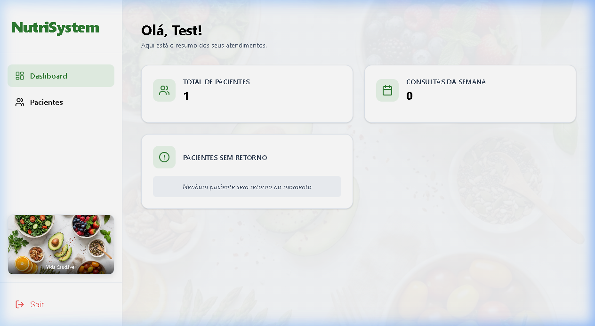

# 🥗 NutriSystem - Sistema de Gestão para Nutricionistas

O **NutriSystem** é uma plataforma moderna e intuitiva desenvolvida para auxiliar nutricionistas na gestão de seus pacientes, acompanhamento clínico e geração inteligente de planos alimentares utilizando Inteligência Artificial.



## 🚀 Tecnologias Utilizadas

O projeto foi construído utilizando as tecnologias mais modernas do ecossistema web:

- **Frontend**: [React](https://reactjs.org/) com [Vite](https://vitejs.dev/) para uma experiência de desenvolvimento ultra-rápida.
- **Estilização**: CSS Nativo (Vanilla CSS) com foco em design premium, Glassmorphism e responsividade.
- **Backend/API**: Node.js com Express para integração com serviços de IA.
- **Banco de Dados**: [Supabase](https://supabase.com/) (PostgreSQL) para autenticação, armazenamento de dados em tempo real e RLS (Row Level Security).
- **Inteligência Artificial**: [Google Gemini AI](https://ai.google.dev/) para geração automatizada e personalizada de planos alimentares baseados em dados clínicos.
- **Gráficos**: [Recharts](https://recharts.org/) para visualização de métricas e progresso dos pacientes.
- **Ícones**: [Lucide React](https://lucide.dev/).

## ✨ Funcionalidades Principais

- **Dashboard Inteligente**: Visão geral dos atendimentos, total de pacientes e lembretes de retorno.
- **Gestão de Pacientes**: Cadastro completo com dados antropométricos (Peso, Altura, IMC, Percentual de Gordura).
- **Cálculo de IMC Automático**: Classificação em tempo real conforme as diretrizes de saúde.
- **Geração de Dieta via IA**: Integração com Gemini AI para criar planos alimentares personalizados em segundos.
- **Segurança de Dados**: Autenticação robusta e proteção de dados sensíveis via políticas de segurança do Supabase.

## 🛠️ Como Executar o Projeto

1. **Clone o repositório**:
   ```bash
   git clone https://github.com/eng-alexandre/Alexandre_nutri.git
   ```

2. **Instale as dependências**:
   ```bash
   npm install
   ```

3. **Configure as variáveis de ambiente**:
   Crie um arquivo `.env.local` com suas credenciais:
   ```env
   VITE_SUPABASE_URL=seu_url_supabase
   VITE_SUPABASE_ANON_KEY=sua_chave_anonima
   GEMINI_API_KEY=sua_chave_gemini
   ```

4. **Inicie o servidor de desenvolvimento**:
   ```bash
   npm run dev
   ```

---
Desenvolvido com ❤️ por [Alexandre](https://github.com/eng-alexandre)
